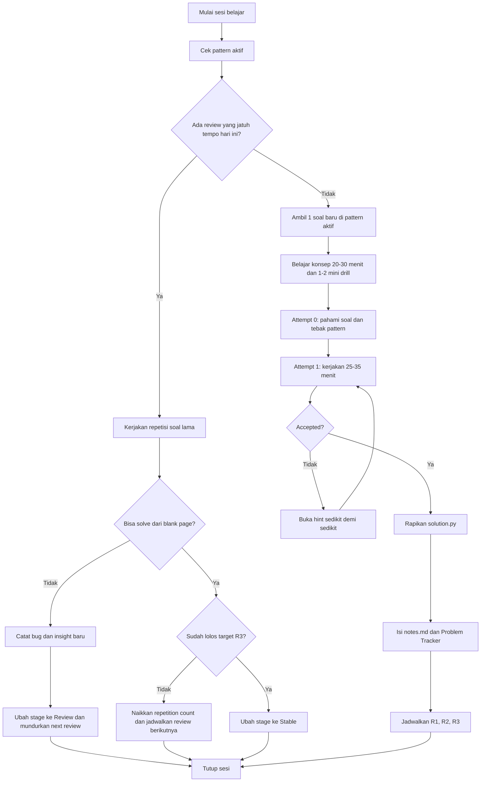
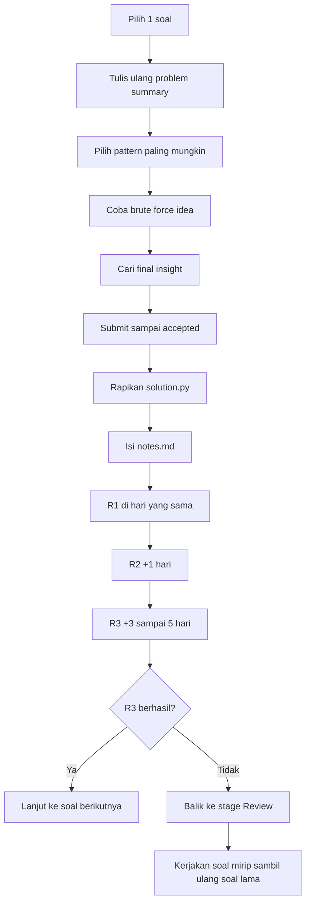

# Workflow Belajar LeetCode

Dokumen ini adalah sumber kebenaran untuk cara belajar di repository `Protein Programmer`.

## North Star

- Tujuan utama: membangun fondasi algoritma dan problem solving.
- Metrik utama: kualitas repetisi, bukan jumlah soal.
- Bahasa utama: Python.
- Ritme default: 3-5 sesi per minggu.

## Visual Flowchart

### 1. Flow sesi belajar



### 2. Flow keputusan per soal



## Pattern Roadmap

Urutan fase awal:

1. Array / Hash Map
2. Two Pointers
3. Stack
4. Sliding Window
5. Binary Search
6. Linked List basics
7. Tree DFS
8. Tree BFS
9. Grid / Graph DFS-BFS

Aturan main:

- Fokus pada satu pattern aktif sebelum loncat ke pattern lain.
- Untuk pattern baru, habiskan 20-30 menit memahami konsep dasarnya.
- Lakukan 1-2 mini drill kecil sebelum masuk ke soal LeetCode penuh.

## Lifecycle Satu Soal

Struktur folder standar:

```text
python-leetcode/<leetcode-id>-<slug>/
├── solution.py
├── notes.md
└── attempts/
    ├── r1.py
    ├── r2.py
    └── r3.py
```

Urutan kerja:

1. `Attempt 0`
   - Tulis ulang masalah dengan bahasamu sendiri.
   - Identifikasi input, output, constraint, dan kandidat pattern.
2. `Attempt 1`
   - Kerjakan sendiri selama 25-35 menit.
   - Jika buntu total lebih dari 10 menit, buka hint sedikit demi sedikit.
3. `Final cleanup`
   - Setelah accepted, rapikan solusi bersih ke `solution.py`.
4. `Notes + tracker`
   - Isi `notes.md` dan update tracker Notion di hari yang sama.

## Jadwal Repetisi

- `R1`: hari yang sama setelah istirahat pendek.
- `R2`: +1 hari.
- `R3`: +3 sampai 5 hari.
- `R4`: +7 sampai 14 hari, hanya kalau soal masih goyah.

Kamu boleh lanjut ke soal berikutnya setelah `R3` berhasil. Tidak perlu menunggu terasa sempurna.

`R3` dianggap berhasil jika kamu bisa:

- menjelaskan pattern dalam 2-3 kalimat,
- menulis solusi dari blank page,
- lolos sample test dan 2-3 edge case buatan sendiri,
- menyelesaikan dalam waktu yang makin masuk akal untuk levelmu.

Kalau gagal di `R2` atau `R3`, soal itu kembali ke stage `Review`, tapi kamu tetap boleh ambil soal baru yang mirip.

## Aturan Catatan

Satu soal tetap satu catatan utama di `notes.md`. Log repetisi disimpan di catatan yang sama, bukan di file note terpisah.

Bagian wajib di `notes.md`:

- `Problem summary`
- `Pattern`
- `Brute force idea`
- `Final insight`
- `Mistakes made`
- `Complexity`
- `Repetition log`
- `Next review`

Setiap entri repetisi minimal mencatat:

- tanggal,
- repetition ke-,
- waktu selesai,
- butuh hint atau tidak,
- bug atau miskonsepsi utama,
- confidence 1-5,
- tanggal review berikutnya.

## Library Python yang Boleh Diandalkan

Standard library yang aman dijadikan andalan:

- `collections`: `deque`, `Counter`, `defaultdict`
- `heapq`
- `bisect`
- `math`
- `itertools`
- `functools.lru_cache`
- `typing`

Hindari third-party library untuk LeetCode algoritma umum. `Pandas` tetap dipakai hanya untuk track Pandas/SQL.

## Rutinitas Mingguan yang Disarankan

Dalam 3-5 sesi per minggu, pola defaultnya:

- 1 soal baru di pattern aktif
- 1-2 sesi repetisi soal lama
- 1 sesi review ringan untuk membaca ulang mistake dan insight

Checklist sesi harian:

- Soal baru apa yang dikerjakan hari ini?
- Soal lama apa yang harus direpetisi hari ini?
- Apakah ada soal yang harus dipindah ke `Review`, `Stable`, atau `Mastered`?

## Notion Tracker

Dashboard Notion induk: `Protein Programmer`.

Database `Problem Tracker` minimal punya field:

- `Problem`
- `LeetCode ID`
- `Pattern`
- `Difficulty`
- `Stage`
- `Repetition Count`
- `Last Solved`
- `Next Review`
- `Confidence`
- `Repo Path`

Stage yang dipakai:

- `New`
- `Review`
- `Stable`
- `Mastered`
